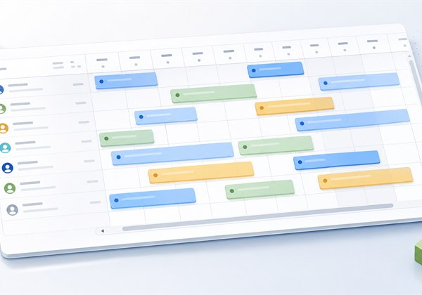

# Resource Planner Widget



Modern pluggable web widget for monthly resource planning.

The widget shows resources as rows and days as columns, with multiple entry cards per resource/day cell. It includes sticky headers and first column, virtual resource-row scrolling, loading skeletons, and actions for resources, entries, and empty cells.

This is a personal open-source project by David Salazar Rodero.

## Status

Beta: `0.1.2`.

The widget is usable, but its public XML/API may still change before a stable `1.0.0` release.

## Getting Started in Mendix Studio Pro

### 1. Create the domain model

Create two persistent entities:

- **Resource** — with at least a `Title` (String) and optionally a `Subtitle` (String).
- **Entry** — with at least a `Title` (String), an optional `Subtitle` (String), and a `Date` (DateTime). Associate it to `Resource` with a many-to-one association (`Resource_Entry` or similar).

### 2. Create a helper (non-persistent) entity

Create a non-persistent entity (e.g. `PlannerContext`) with a single `VisibleMonth` attribute of type DateTime. This object drives which month the planner displays.

### 3. Create a microflow to initialize the helper

Create a microflow (e.g. `ACT_PlannerContext_Create`) that creates and returns a `PlannerContext` object with `VisibleMonth` set to the current date (`[%CurrentDateTime%]`).

### 4. Set up the page

Place a **Data View** on your page, set its data source to the microflow from step 3. Place the **Resource Planner** widget inside the data view.

### 5. Configure the widget — View tab

- Set **Visible month attribute** to `PlannerContext/VisibleMonth`.
- Adjust **Visible resource rows**, **Resource column width**, and weekend/height options as needed.

### 6. Configure the widget — Resources tab

- Set the **Resources data source** to your `Resource` entity.
- Set **Resource title** and optionally **Resource subtitle**.

### 7. Configure the widget — Entries tab

- Set the **Entries data source** to your `Entry` entity (filtered to the visible month if needed).
- Set **Resource association** to the association between `Entry` and `Resource`.
- Set **Entry date**, **Entry title**, and optionally **Entry subtitle** and **Color class**.

### 8. Configure interactions (optional)

Use **On resource click**, **On entry click**, and **On empty cell click** to open pages or trigger microflows. The empty cell click exposes two action variables:

- `resourceGuid` (String) — GUID of the clicked resource.
- `date` (DateTime) — date represented by the clicked cell.

## Known Limitations

- No drag and drop.
- No multi-day range rendering.
- Entries should be filtered to the visible month in the data source when needed.

## Development

```powershell
npm.cmd run lint
npm.cmd test
npm.cmd run build
```

The MPK is generated as `dist/0.1.2/ResourcePlannerWidget.mpk`.
